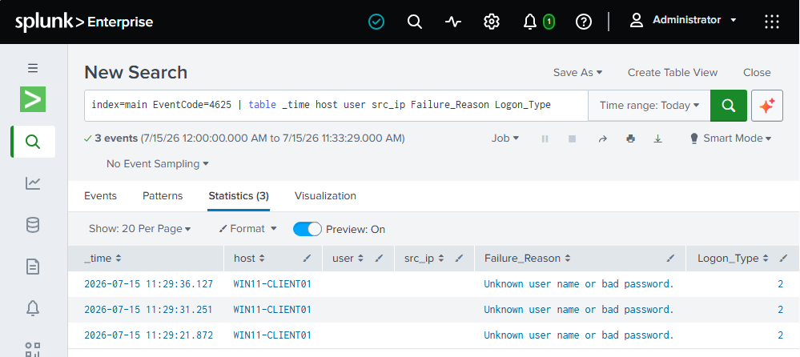
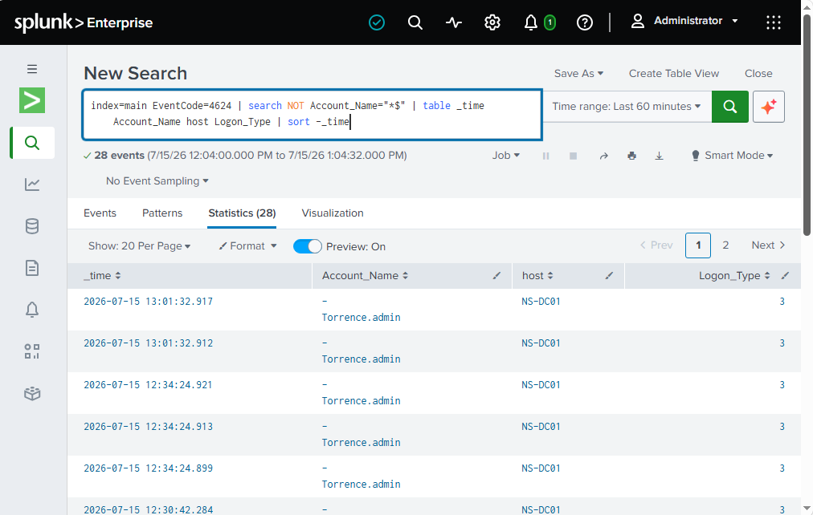
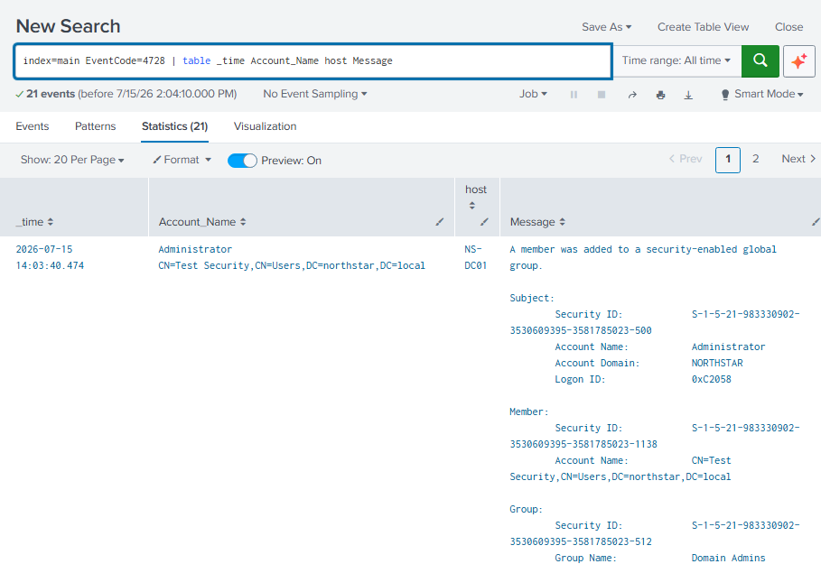
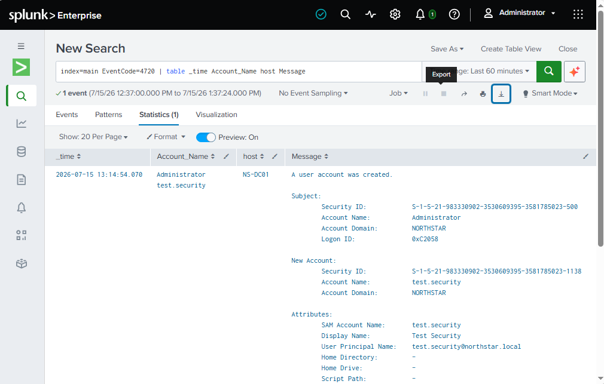
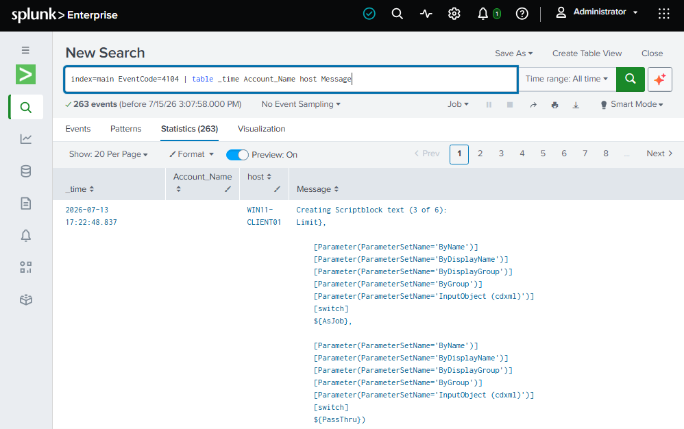

# Northstar Manufacturing Incident Response Report

## Incident Title

Simulated Security Incident Investigation - Unauthorized Account Activity

---

# Incident Overview

## Organization

Northstar Manufacturing

## Incident Type

Simulated Security Incident

## Severity

High

## Status

Investigation Complete

## Date

07-20-2026

---

# Executive Summary

This document describes a simulated security incident investigation performed within the Northstar Manufacturing enterprise security lab.

The objective of this exercise was to demonstrate incident detection, investigation, and response using centralized security monitoring through Splunk Enterprise.

The simulated attack scenario involved unauthorized account activity, suspicious authentication attempts, privilege escalation behavior, and possible attacker persistence techniques.

Security events were collected from Windows Security Event Logs and analyzed using predefined Splunk detection rules mapped to MITRE ATT&CK techniques.

---

# Environment

## Affected Systems

| Hostname | Purpose |
|---|---|
| NS-DC01 | Primary Domain Controller |
| WIN-11-CLIENT | Windows Client Workstation |
| NS-SIEM01 | Splunk Enterprise SIEM |
| NS-VULN01 | Vulnerability Management Server |

---

# Detection Sources

## Security Monitoring Platform

Splunk Enterprise

## Data Sources

- Windows Security Event Logs
- PowerShell Operational Logs
- System Event Logs

## Detection Framework

MITRE ATT&CK

---

# Incident Scenario

## Initial Access

An attacker obtained access to a admin account through password guessing or credential compromise.

Indicators:

- Multiple failed authentication attempts
- Successful login following failed attempts
- Abnormal authentication activity

MITRE ATT&CK:

- T1110 - Brute Force
- T1078 - Valid Accounts

---

# Detection Timeline

## Phase 1 - Suspicious Authentication Activity

### Detection

Windows Event ID:

4625 - Failed Logon

Splunk Detection:

DET-001 Failed Logon Detection

Evidence:

Analyst Findings:

- Multiple authentication failures were observed.
- Activity required investigation to determine whether it was user error or malicious activity.

---

## Phase 2 - Successful Account Access

### Detection

Windows Event ID:

4624 - Successful Logon

Evidence:

Analyst Findings:

- Successful authentication occurred after failed attempts.
- Account activity was reviewed for legitimacy.

MITRE ATT&CK:

- T1078 - Valid Accounts

---

## Phase 3 - Privilege Escalation Attempt

### Detection

Security Event:

4728 - Group Membership Modification

Evidence:

Analyst Findings:

- Security group membership changes were reviewed.
- Investigation focused on unauthorized privilege assignment.

MITRE ATT&CK:

- T1098 - Account Manipulation

---

## Phase 4 - Persistence Attempt

### Detection

Security Event:

4720 - New User Creation

Evidence:

Analyst Findings:

- Security group membership changes were reviewed.
- Investigation focused on unauthorized privilege assignment.

MITRE ATT&CK:

- T1098 - Account Manipulation

---

## Phase 5 - Suspicious Command Execution

### Detection

PowerShell Script Block Logging:

4104

Evidence:

Analyst Findings:

- PowerShell activity was reviewed for suspicious commands.
- Command execution was correlated with user activity.

MITRE ATT&CK:

- T1059.001 - PowerShell

---

# Investigation Findings

The investigation identified the following security behaviors:

| Activity | Detection | Severity |
|-|-|-|
| Failed authentication attempts | DET-001 | Medium |
| Successful login activity | DET-002 | Medium |
| New user creation | DET-003 | High |
| Account modification | DET-004 | Medium |
| Group membership change | DET-005 | High |
| Process execution | DET-006 | Medium |
| Audit policy modification | DET-007 | High |
| Windows service creation | DET-008 | High |
| PowerShell execution | DET-009 | High |
| Account lockout activity | DET-010 | High |

---

# Containment Actions

Recommended response actions:

- Disable compromised accounts
- Reset affected passwords
- Remove unauthorized group memberships
- Review administrative accounts
- Isolate affected endpoints
- Preserve event logs for investigation

---

# Eradication Actions

Actions performed:

- Removed unauthorized accounts
- Verified security group membership
- Reviewed persistence mechanisms
- Confirmed logging remained enabled
- Updated security monitoring rules

---

# Recovery Actions

Recovery steps:

- Restore normal account access
- Verify endpoint security controls
- Monitor authentication activity
- Perform vulnerability assessment

---

# Lessons Learned

The incident demonstrated the importance of:

- Centralized SIEM monitoring
- Windows event collection
- MITRE ATT&CK mapping
- Account activity monitoring
- Vulnerability management integration
- Incident response documentation

---

# Related Security Controls

| Control | Implementation |
|-|-|
| Logging | Splunk Enterprise |
| Authentication Monitoring | Windows Security Logs |
| Vulnerability Management | Nessus |
| Identity Security | Active Directory |
| Endpoint Security | Windows Defender |
| Detection Engineering | Splunk Rules |

---

---

# Final Assessment

The simulated incident demonstrated that Northstar Manufacturing's security architecture can detect and investigate common attacker behaviors.

Splunk Enterprise provided centralized visibility, while MITRE ATT&CK mappings assisted analysts in understanding attacker techniques and response requirements.

Future improvements include:

- Cloud logging integration
- Automated alert response
- Formal risk register tracking
- Attack simulation exercises
- Security orchestration and automation